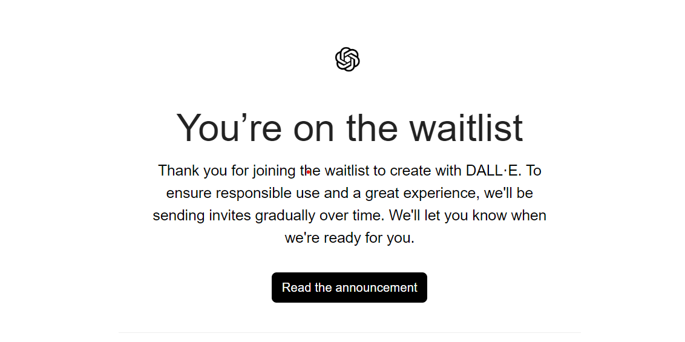
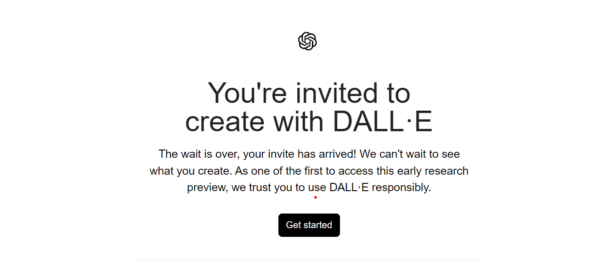
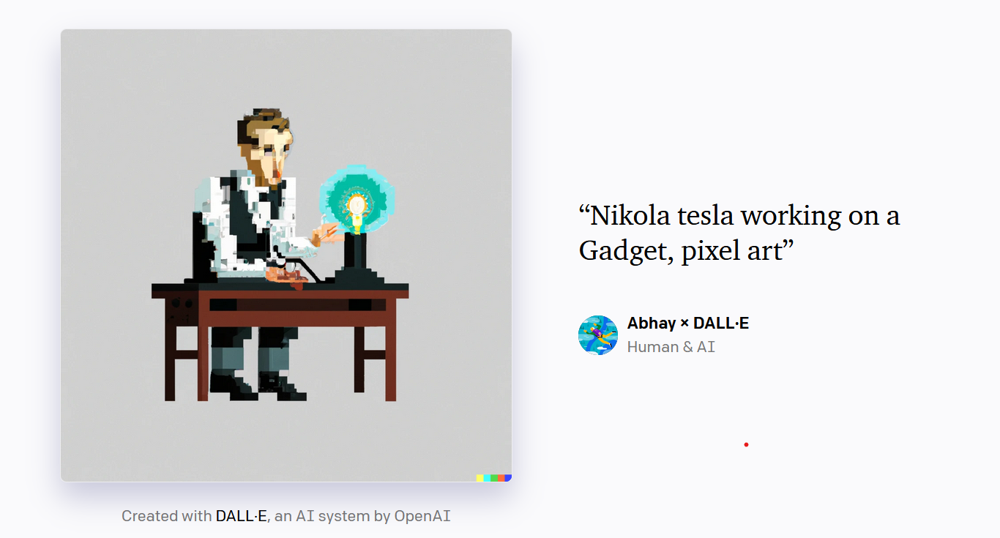

# I Got access to the Dall-E 2 and here what i created first

it was Thu, Apr 7, 10:52 PM when i joined the waitlist for the Dall-E 2.

comeback to today I got access to for using it, big thanks to the Dall-E 2 team for giving me access to it.

## I x Dalle

actually i has been interacting with ai model / tool like Github Copilot, and i was impressived by the way it worked.
So i was super excited to try dalle out

Here, are few results of my first try with dalle

**live 🔴** [Abhay x Dall•E](https://labs.openai.com/s/rwLP4Wa7Dur2JEyUIZywdDR1)
<!-- iamge with link -->

`
“Nikola tesla working on a Gadget, pixel art”
`

this is my favourite one, i am super impressed by the way it 
worked

share your comment that i should try with dalle out

<!-- twitte  -->
[twitter : @abhayprajapati_](https://twitter.com/abhayprajapati_)
